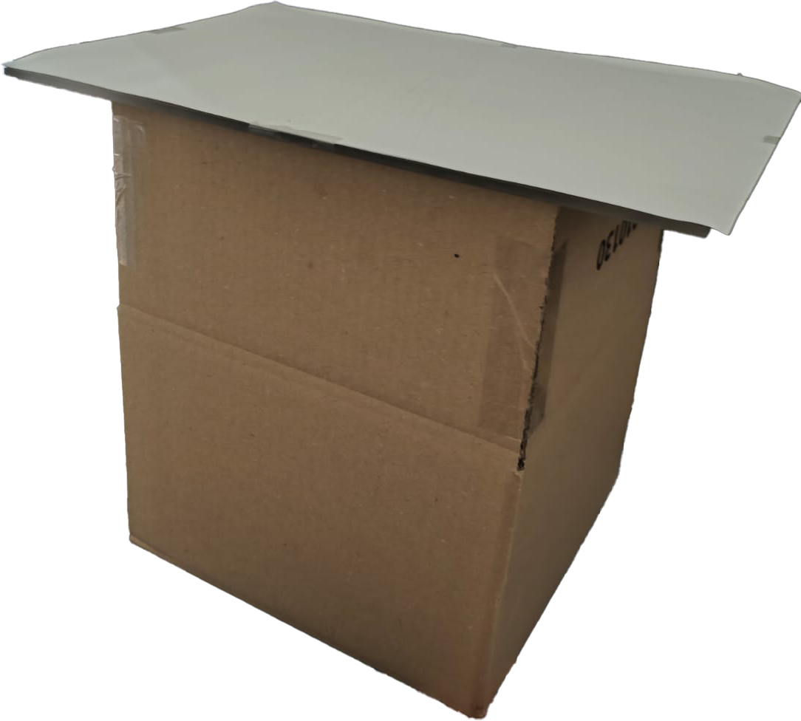
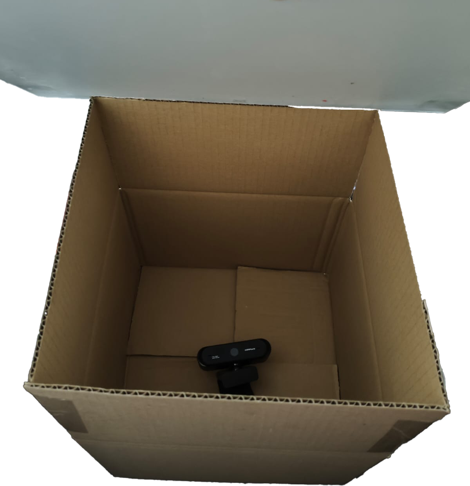

[](https://classroom.github.com/a/BegzSP5S)

# 📦 Box Input Device

Ein DIY-Eingabegerät, das aus einer einfachen Pappschachtel, Acrylglas und Papier besteht.  
Berührungen und Taps durch Finger (oder noch besser ein schwarzer dicker Stift o.Ä.) als Stylus) werden erkannt, an den Rechner übertragen – und optional durch eine nachgeschaltete Handschrift-Erkennung ausgewertet. 

Das Programm 'fitts_law.py' kann per DIPPID mit dem touch recognizer gesteuert werden, resultate werden in einer .csv gespeichert. Zum starten davon kann das Command 'python fitts_law.py 10 40 200 0' genutzt werden.

Genauere Informationen zum Aufbau, Design-Prozess und Anwendungshinweise finden sich in `documentation.md` 

---

## 🖼️ Aufbau

| Bild | Beschreibung |
| :--- | :----------- |
|  | Außengehäuse: Pappschachtel mit Acryl-Deckfläche |
|  | Innenansicht: Eigene USB-Webcam (ersetzt ursprünglich geplante Intel RealSense-Kamera da diese nicht funktionierte) |

---

# ✍️ Handwriting Recognizer

Aufbauend auf `touch_input.py` gibt es auch `touch_input_with_recognizer`. Dieses Programm erlaubt das Malen von Shapes / Buchstaben und benutzt den 1$-Recongizer Algorithmus (`recongizer.py` übernommen von ITT-Assignment-06) um diese Robust zu erkennen. Es poppt zusätzlich als Guide ein Fenster mit allen verfügbaren Zeichen auf, welche als .xml in letter_templates gespeichert sind.

Inputs erlauben dann via Pynput das schreiben auf dem PC. Die verfügbaren Symbole könnten auch leicht beliebig erweitert werden um z. B. Media Controls einzubauen. Mehr details über den Handwriting Recgonizer stehen zusätzlich in `documentation.md`

---

## 🚀 Installation

1. **Repository klonen**
   ```bash
   git clone https://github.com/ITT-25/assignment-07-touch-sensor-uniUbungsAccount.git
   cd <assignment-07-touch-sensor-uniUbungsAccount.git>


Zunächst Git-Repo clonen/runterladen, dann:

1. **Virtuelle Umgebung erstellen und aktivieren**
    ```
    python -m venv venv
    # Windows:
    venv\Scripts\activate
    ```

2. **Abhängigkeiten installieren**
    ```
    pip install -r requirements.txt
    ```

## Starten

1. Für Fitts Law Test: cmd im Ordner: `python touch_input.py`
2. Für Letter-Recognition:


